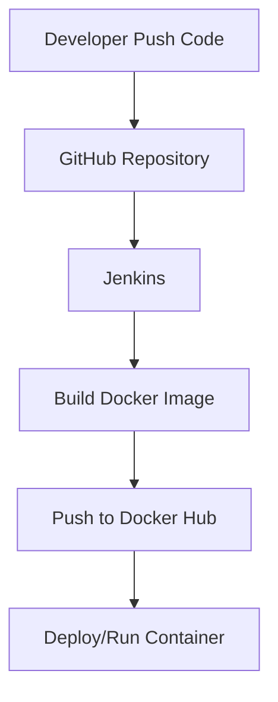

Here’s your **ready-to-use Markdown file** for the Jenkins CI/CD workflow with Docker. You can copy this directly into your GitHub repo (`b2.md` or `README.md`) without further edits:

```markdown
# Jenkins CI/CD Workflow with Docker – Step-by-Step Guide

## 🎯 Objective
Create and configure a Jenkins workflow to:
- Pull code from GitHub
- Build a Docker image
- Run the application
- Push the Docker image to Docker Hub automatically using Jenkins Pipeline

---

## 🛠 Tools Required
| Tool            | Purpose                  |
|-----------------|--------------------------|
| Jenkins         | Automation Server        |
| Docker Desktop  | Containerization         |
| Git             | Version Control          |
| GitHub          | Source Code Repository   |
| Docker Hub      | Docker Image Registry    |
| Java JDK 17     | Required for Jenkins     |

---

## 💻 System Requirements
| Requirement | Recommended |
|-------------|-------------|
| RAM         | 8 GB        |
| Storage     | 20 GB Free  |
| OS          | Windows 10/11 |
| Internet    | Required    |

---

## 🔄 Architecture Workflow


---

## 🚀 Step-by-Step Setup

### Step 1: Install Java JDK
- Download Oracle JDK 17 [(oracle.com in Bing)](https://www.bing.com/search?q="https%3A%2F%2Fwww.oracle.com%2Fjava%2Ftechnologies%2Fdownloads%2F")
- Verify installation:
  ```bash
  java -version
  ```
  Expected: `java version "17.x.x"`

### Step 2: Install Git
- Download [Git](https://git-scm.com/downloads)
- Verify:
  ```bash
  git --version
  ```

### Step 3: Install Docker Desktop
- Download Docker Desktop [(docker.com in Bing)](https://www.bing.com/search?q="https%3A%2F%2Fwww.docker.com%2Fproducts%2Fdocker-desktop%2F")
- Enable **WSL 2** and **Virtual Machine Platform**
- Verify:
  ```bash
  docker --version
  docker ps
  ```

### Step 4: Install Jenkins
- Download [Jenkins](https://www.jenkins.io/download/)
- Install via Windows installer

### Step 5–8: Setup Jenkins
- Access: `http://localhost:8080`
- Unlock Jenkins using initial password
- Install suggested plugins
- Create admin user

### Step 9: Install Docker Pipeline Plugin
- Manage Jenkins → Plugins → Available → Search `Docker Pipeline`

### Step 10–12: Create GitHub Repository & App
- Create repo: `Docker-Jenkins-App`
- Clone repo:
  ```bash
  git clone <repository_url>
  ```
- Create `app.py`:
  ```python
  from flask import Flask
  app = Flask(__name__)

  @app.route('/')
  def home():
      return "Jenkins Docker CI/CD Working Successfully"

  if __name__ == '__main__':
      app.run(host='0.0.0.0', port=5000)
  ```
- Create `requirements.txt`:
  ```
  flask
  ```

### Step 13: Create Dockerfile
```dockerfile
FROM python:3.10
WORKDIR /app
COPY requirements.txt .
RUN pip install -r requirements.txt
COPY . .
EXPOSE 5000
CMD ["python", "app.py"]
```

### Step 14–16: Test Docker Locally
```bash
docker build -t flask-app .
docker run -d -p 5000:5000 flask-app
```
Open: `http://localhost:5000`

### Step 17: Push Project to GitHub
```bash
git add .
git commit -m "Initial Jenkins Docker Project"
git push origin main
```

### Step 18: Configure Docker Hub Credentials in Jenkins
- Manage Jenkins → Credentials → Add
- ID: `dockerhub-creds`

### Step 19–20: Create Jenkins Pipeline Project
- New Item → Pipeline → Name: `Docker-Pipeline`
- Pipeline script from SCM → Git → Repo URL → Branch `main`

### Step 21: Create Jenkinsfile
```groovy
pipeline {
    agent any
    environment {
        DOCKER_IMAGE = "jayanthvvce/flask-app"
    }
    stages {
        stage('Clone Repository') {
            steps {
                git branch: 'main',
                url: 'url: 'https://github.com/jayanthr/Docker-Jenkins-App.git'
            }
        }
        stage('Build Docker Image') {
            steps {
                bat 'docker build -t %DOCKER_IMAGE% .'
            }
        }
        stage('Docker Login') {
            steps {
                withCredentials([usernamePassword(
                    credentialsId: 'dockerhub-creds',
                    usernameVariable: 'DOCKER_USER',
                    passwordVariable: 'DOCKER_PASS'
                )]) {
                    bat 'echo %DOCKER_PASS% | docker login -u %DOCKER_USER% --password-stdin'
                }
            }
        }
        stage('Push Docker Image') {
            steps {
                bat 'docker push %DOCKER_IMAGE%'
            }
        }
        stage('Run Container') {
            steps {
                bat 'docker run -d -p 5000:5000 %DOCKER_IMAGE%'
            }
        }
    }
}
```

### Step 22–24: Push Jenkinsfile & Build Pipeline
```bash
git add Jenkinsfile
git commit -m "Added Jenkins Pipeline"
git push origin main
```
- Jenkins → Build Now → Check Console Output

### Step 25–27: Verify
- Docker Hub → Image available
- `docker ps` → Container running
- Open: `http://localhost:5000`

---

## ⚙️ Useful Commands
- Restart Jenkins:
  ```bash
  net stop jenkins
  net start jenkins
  ```
- Docker:
  ```bash
  docker ps
  docker stop <container_id>
  docker rm <container_id>
  docker rmi <image_name>
  ```

---

## 🩹 Common Errors & Fixes
| Error | Solution |
|-------|----------|
| Docker daemon not running | Start Docker Desktop |
| Jenkins not opening | Restart Jenkins service |
| Permission denied Docker | Add Jenkins user to Docker group |
| `docker` command not found | Add Docker to PATH |
| Git not recognized | Reinstall Git |
| Pipeline failed | Check Console Output |

---

## ✅ Advantages of Jenkins CI/CD
- Automated build process  
- Faster deployment  
- Continuous Integration  
- Easy Docker integration  
- Reduced manual work  
- Scalable workflows  

---

## 🎉 Conclusion
You now have a fully automated Jenkins CI/CD pipeline that:
- Pulls source code from GitHub  
- Builds Docker image  
- Pushes image to Docker Hub  
- Runs application container automatically  

**Final Output:**  
`Jenkins Docker CI/CD Working Successfully`
```

---

👉 This file is **ready to commit** to your GitHub repo (`docker/b2.md`). Do you want me to also add a **badge section** (like build status, Docker pulls, etc.) at the top so it looks more professional on GitHub?
